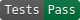

# Activity-Log-Library

Use the Activity Log library to add the following to your GovUk Laravel project

* thing 1
* thing 2

## Installation
Via Composer: `composer require networkrailbusinesssystems/support-page`
